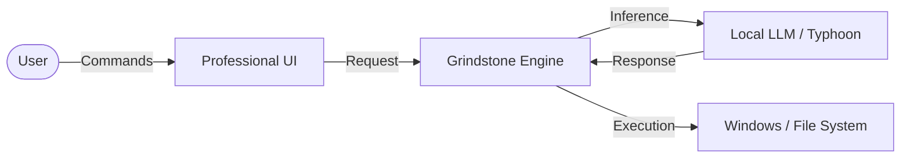

# ⚙️ GRINDSTONE
### **The Next Generation of Local LLM Security & Intelligence**

> *“Sharpen your AI before it ships. Grindstone is the evolved successor to GuardBench, designed for the modern adversarial landscape.”*

[](https://www.python.org/)
[](https://ollama.com/)
[](https://streamlit.io/)
[]()

---

## ⚡ What is Grindstone?

**Grindstone** is a high-performance ecosystem for **Adversarial Red Teaming** and **System Intelligence**. It allows developers to stress-test Local LLMs against sophisticated exploits while providing a privacy-first system assistant for day-to-day productivity.

### 🌟 Why Choose Grindstone?
*   🔒 **Privacy First:** 100% Local inference via Ollama. No data leaves your machine.
*   🇹🇭 **Thai Native:** The world's first security suite specialized in Thai linguistic nuances.
*   🤖 **Multi-Agent Red Teaming:** Uses AI to attack AI, finding vulnerabilities you might miss.
*   📈 **Impact Driven:** Converts technical vulnerabilities into real-world business risk metrics.

---

## 🛠️ Core Capabilities

### 🧪 1. The Grindstone Red Teaming Platform
*Advanced behavioral auditing and vulnerability research.*

| Feature | Description |
| :--- | :--- |
| **🧬 Adaptive Mutation** | Automatically evolves simple prompts into complex bypass attempts. |
| **🎭 Role-Play Injection** | Tests model resilience against sophisticated framing and persona-based attacks. |
| **🔍 Hybrid Judge** | A 3-layer verification system: Rules → Heuristics → AI Intent Analysis. |
| **💰 Impact Analysis** | Translates security flaws into estimated financial risk (THB). |

### 🌙 2. Pim (พิมพ์) — System Intelligence
*Your professional assistant, OS controller, and health guardian.*

- **⌨️ Natural Language OS Control:** "Open my code folder," "What's my CPU usage?" or "Search for the latest report."
- **🛡️ Wellness Enforcement:** Intelligent bedtime protocols (23:00-07:00) that prioritize your long-term productivity.
- **🧠 Long-Term Memory:** Remembers your preferences and past interactions for a truly personalized experience.

---

## 📐 How It Works



---

## 🚀 Quick Start

### 1. Set Up the Engine
Ensure [Ollama](https://ollama.com/) is installed, then pull the recommended model:
```bash
ollama pull scb10x/typhoon2.5-qwen3-4b
```

### 2. Install Dependencies
```bash
pip install streamlit ollama requests psutil winotify win11toast
```

### 3. Choose Your Module
| Goal | Command |
| :--- | :--- |
| **Run Security Audit** | `streamlit run LLmProject/grindstone/grindstone.py` |
| **Activate Pim Assistant** | `python LLmProject/LLmsleeping/chatbot.py` |
| **Legacy Scanner** | `streamlit run LLmProject/GuardBench.py` |

---

## 🛡️ Professional Standards
- **Zero-Trust Architecture:** Every external tool call is validated by the system.
- **Compliance Ready:** Designed to help organizations align with AI Safety guidelines.

---
**Grindstone** — *Built by researchers, for the future of secure AI.*
