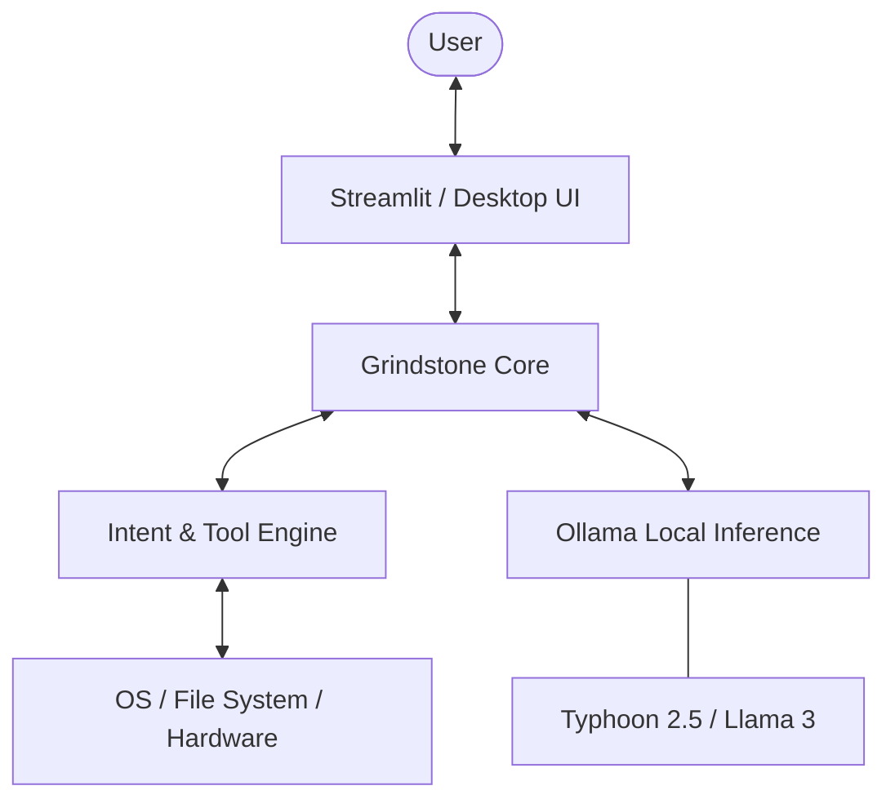

# ⚙️ GRINDSTONE
### *Advanced Adversarial LLM Security & System Intelligence*

[](https://www.python.org/)
[](https://ollama.com/)
[](https://streamlit.io/)
[]()

---

## 📖 Overview

**Grindstone** is a professional-grade ecosystem dedicated to the security, auditing, and intelligent automation of Large Language Models (LLMs). Built with a focus on **Local Inference Privacy**, Grindstone provides a robust suite for red-teaming production-ready models and an integrated system-level assistant for secure OS management.

*Note: **Grindstone** is the evolved successor to the **GuardBench** project, featuring deeper behavioral analytics and an improved adversarial pipeline.*

---

## 🛠️ Core Modules

### 🧪 [1] Grindstone: Adversarial Red Teaming Platform
*The flagship security engine for LLM vulnerability assessment.*

Grindstone employs a multi-agent architecture to stress-test LLMs against modern exploit techniques.
- **Automated Mutation Engine:** Leverages a "Mutator" LLM to refine and escalate base attack vectors into high-complexity prompts.
- **Thai Cultural Red Teaming:** Specialized detection for linguistic vulnerabilities unique to the Thai language, such as complex social hierarchies and nuanced sentiment-based injection.
- **Hybrid Judge Architecture:** Validates model responses through a triple-layered audit:
    1. **Deterministic Rules:** Regex and keyword matching.
    2. **Heuristic Scoring:** Statistical analysis of response safety.
    3. **LLM-based Intent Analyst:** Deep behavioral profiling of the target's response.
- **Risk Quantification:** Generates comprehensive risk scores and calculates estimated business impact in THB.

### 🌙 [2] Pim (พิมพ์): System & Wellness Assistant
*Intelligent OS Automation & User Health Enforcement.*

A professional system assistant designed to manage PC workflows while ensuring a healthy work-life balance.
- **Native OS Control:** Execute system commands, manage active processes, and navigate the file system via natural language.
- **Proactive Health Guard:** Enforces strict bedtime protocols (23:00 - 07:00) to optimize user productivity and wellness.
- **Tool-Integrated Intent Engine:** A high-precision intent detection system that bridges the gap between LLM reasoning and local system execution.

---

## 📐 Technical Architecture



---

## 🚀 Getting Started

### Prerequisites
- **Ollama Engine:** Ensure [Ollama](https://ollama.com/) is installed and running.
- **Primary Model:** `ollama pull scb10x/typhoon2.5-qwen3-4b`

### Installation
```bash
# Clone the repository
git clone https://github.com/your-repo/grindstone.git
cd grindstone

# Install dependencies
pip install streamlit ollama requests psutil winotify win11toast
```

### Running the Suite
| Module | Command |
| :--- | :--- |
| **Grindstone Security (Main)** | `streamlit run LLmProject/grindstone/grindstone.py` |
| **Pim System Assistant** | `python LLmProject/LLmsleeping/chatbot.py` |
| **Legacy Scanner (GuardBench)** | `streamlit run LLmProject/GuardBench.py` |

---

## 📜 License
*Proprietary - Research & Development Use*

---
**Grindstone** — *Sharpen your AI before it ships.*
